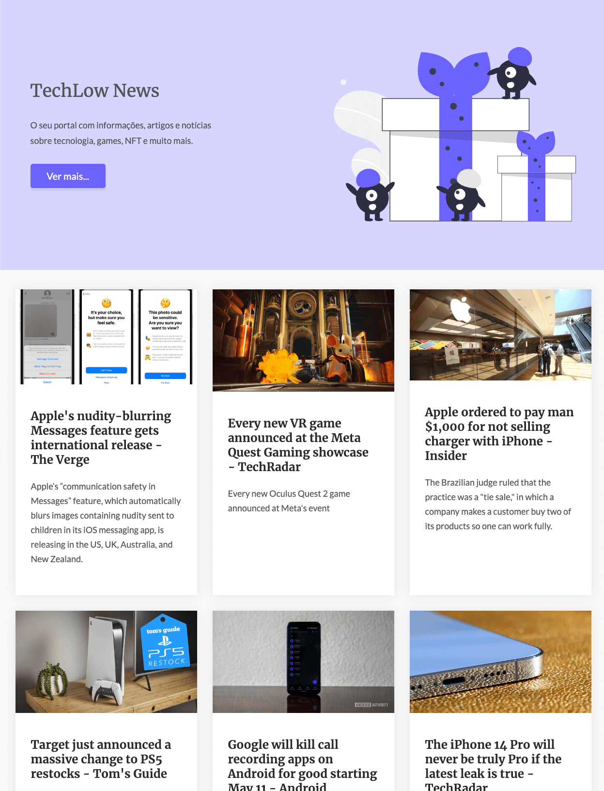

# Challenge 03 - Codelândia :: One Page

[comment]: <> ()

<a href="https://github.com/iuricode" target="_blank">Layout desenvolvido por Iuri Silva :: Codelândia</a>

Challenge 03 - Codelândia :: O projeto de design do One Page é um projeto de página única (single page) foi desenvolvido com o Nuxt 3 para melhorar as
habilidades de Nuxt, Vue, Sass, Javascript e também a aquisição de conhecimento de novos plugins.

## Tecnologias e Ferramentas

## Instalação e execução

1. Clonar o repositório `https://github.com/felipepanegalli/03-one-page-codelandia.git`;
2. Instalar as dependências `yarn install`;
3. Executar o projeto com `yarn dev`;
4. O projeto será executado em `http://localhost:3000/`;